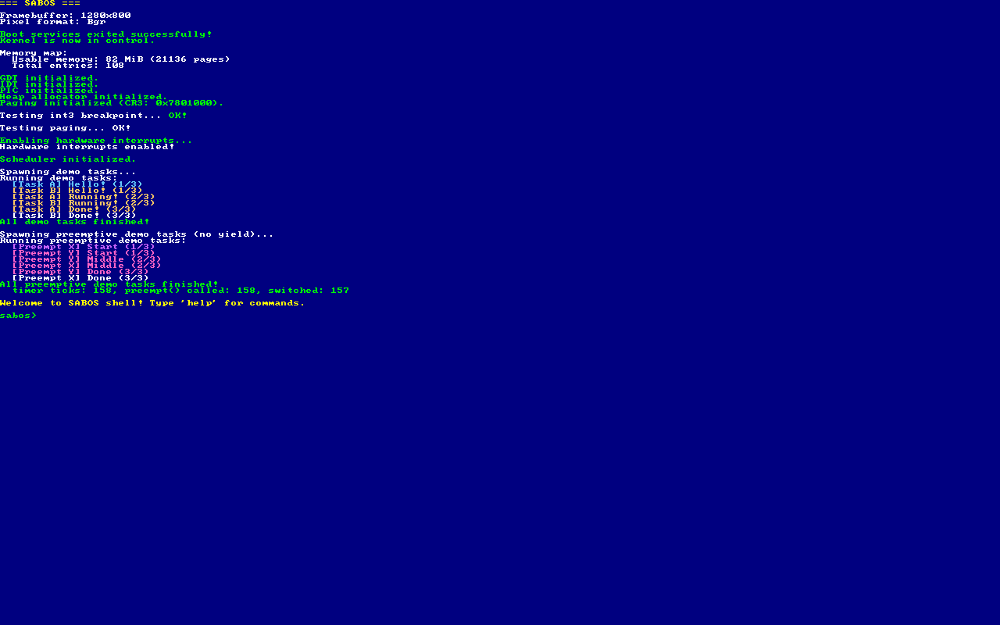
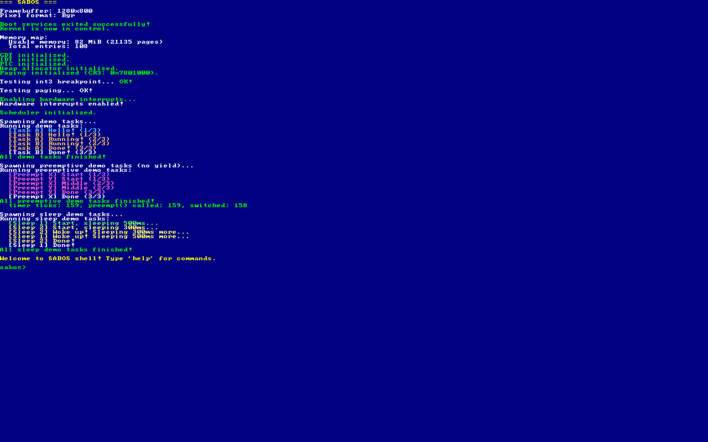
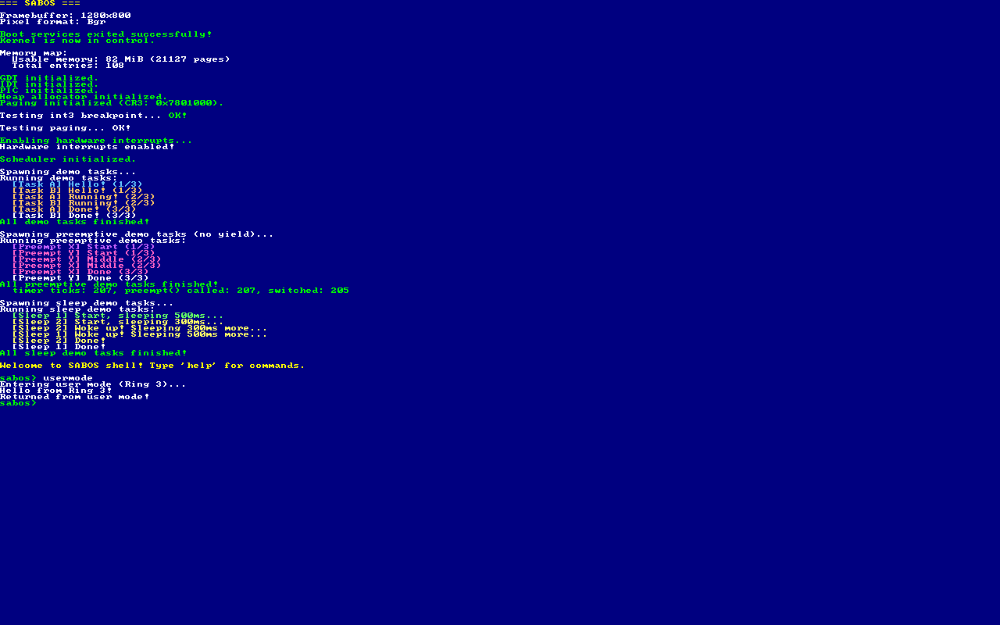
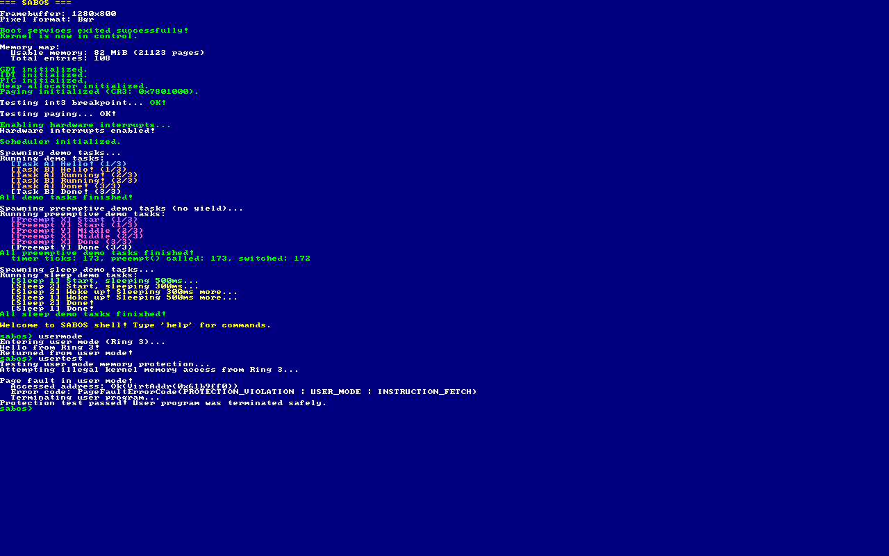

# 2026-02-02: Day 2 — メモリ管理の強化とタスクの世界へ

Day 1 ではブートからシェルまで一気に駆け抜けた。今日はカーネルの内部をもっと「ちゃんとした OS」に近づけていく。

## 今日のゴール

1. **ビットマップアロケータ**: バンプ方式の物理フレームアロケータをビットマップ方式に置き換える。フレームの解放ができるようになり、メモリの再利用が可能に
2. **プロセス / タスクの基盤**: カーネルタスクの概念を導入し、コンテキストスイッチの基盤を作る。最終的には複数タスクの協調的マルチタスクを目指す

Day 1 の「次にやりたいこと」リストをそのまま消化していく形。

## 実装計画

### Task 1: ビットマップフレームアロケータ

現在の `BumpFrameAllocator` はフレームの解放ができない。ビットマップ方式に置き換えて `deallocate_frame()` を追加する。

**変更ファイル:**
- `kernel/src/memory.rs` — `BumpFrameAllocator` → `BitmapFrameAllocator` に置き換え
  - ビットマップ (`Vec<u64>`) で各フレームの使用/空き状態を管理。1ビット = 1フレーム
  - `allocate_frame()`: ビットマップから空きビットを探してセット
  - `deallocate_frame()`: 指定フレームのビットをクリア
  - `free_frames()`: 空きフレーム数を返す統計関数
  - 既存の `MemoryRegion` / `FRAME_ALLOCATOR` / `init()` のインターフェースは維持
- `kernel/src/shell.rs` — `mem` コマンドで空きフレーム数も表示

### Task 2: 協調的マルチタスク — タスク構造体とスケジューラ

カーネルタスクの概念を導入する。各タスクは独自のスタックを持ち、`yield` で自発的に CPU を譲る（協調的マルチタスク）。

**変更ファイル:**
- `kernel/src/task.rs` (新規) — タスクの定義
  - `Task` 構造体: タスク ID、状態、スタック、コンテキスト（レジスタ保存領域）
  - `TaskState`: Running / Ready / Finished
  - `Context` 構造体: callee-saved レジスタ (rbx, rbp, r12-r15, rsp) の保存領域
- `kernel/src/scheduler.rs` (新規) — ラウンドロビンスケジューラ
  - タスクキュー (`VecDeque<Task>`)
  - `spawn()`: 新しいタスクを登録
  - `schedule()`: 次のタスクに切り替え
  - `context_switch()`: アセンブリでレジスタ退避/復帰（`naked_fn` or グローバルアセンブリ）
- `kernel/src/main.rs` — `mod task; mod scheduler;` 追加、デモタスクを生成して動作確認
- `kernel/src/shell.rs` — `ps` コマンドでタスク一覧を表示

### Task 3: プリエンプティブマルチタスク（タイマー割り込みベース）

タイマー割り込み (IRQ 0) でスケジューラを呼び出し、タスクを強制切り替えする。

**変更ファイル:**
- `kernel/src/interrupts.rs` — タイマー割り込みハンドラから `scheduler::preempt()` を呼ぶ。PIC マスクの明示的設定も追加
- `kernel/src/scheduler.rs` — `preempt()` 関数を追加（`try_lock` でデッドロック回避）
- `kernel/src/main.rs` — プリエンプティブデモタスク（yield を使わないビジーループ）を追加

### Task 4: sleep / タイマー機能

今のタスクは busy-wait か yield しかできない。PIT のティックカウントを使ってタスクを一定時間スリープさせる機能を実装する。

**変更ファイル:**
- `kernel/src/scheduler.rs` — TaskState に Sleeping を追加。`sleep_ticks()` / `sleep_ms()` 関数を追加。`preempt()` でスリープ中タスクの起床判定
- `kernel/src/interrupts.rs` — tick カウントの公開（既存の TIMER_TICK_COUNT を利用）
- `kernel/src/main.rs` — sleep を使うデモタスクを追加
- `kernel/src/shell.rs` — ps コマンドで Sleeping 状態を表示

## 実装ログ

### Task 1: ビットマップフレームアロケータ ✅

Day 1 で作ったフレームアロケータは「バンプアロケータ」という方式だった。これは「次に空いてるフレームの番号」のカウンターだけを持っていて、割り当てるたびに +1 するだけのシンプルな仕組み。高速だけど、途中のフレームを解放して再利用する手段がない。カウンターを戻すだけじゃ途中の穴は管理できないから。

今回これを「ビットマップアロケータ」に置き換えた。各フレームに 1 ビットを割り当てて、0 なら空き、1 なら使用中。解放したければそのビットを 1→0 にするだけ。各フレームの状態を個別に記録しているから、どこでも好きに割り当て・解放できる。`Vec<u64>` でビットマップを持ち、1 つの u64 で 64 フレーム分を管理する。空きビットの探索は `(!word).trailing_zeros()` で高速にできる。ビット反転して trailing zeros を数えれば「最初の 0 ビットの位置」が一発でわかる。

シェルの `mem` コマンドも空きフレーム数を表示するように更新した。

### Task 2: 協調的マルチタスク ✅

ここからマルチタスクの世界に入る。まずは「協調的マルチタスク (cooperative multitasking)」から。これは複数のタスクが自発的に CPU を譲り合う方式で、タスク自身が `yield_now()` を呼ばない限り永遠にそのタスクが動き続ける。Windows 3.1 や Classic Mac OS がこの方式だった。タスクが行儀よく yield してくれないとシステム全体が止まるという弱点がある。

タスクを切り替えるにはコンテキストスイッチ (context switch) が必要。これは今のタスクの CPU レジスタ（CPU の作業用変数のようなもの）をメモリに退避して、次のタスクのレジスタをメモリから復帰する操作のこと。実質的にはスタックポインタ (rsp) を切り替えるだけで、タスクの実行状態が丸ごと入れ替わる。

ただし全レジスタを保存する必要はない。x86_64 の関数呼び出し規約には callee-saved レジスタ（呼ばれた側が保存する責任を持つレジスタ）という概念があって、コンテキストスイッチではこれだけ保存すれば十分。残りの caller-saved レジスタは呼び出し側が既にスタックに保存済みだから。Microsoft x64 ABI（UEFI ターゲットが使う ABI）では rbx, rbp, rdi, rsi, r12-r15 が callee-saved。

`global_asm!` でコンテキストスイッチのアセンブリを書いた。8 個の callee-saved レジスタを push → rsp を保存 → 新しい rsp をロード → pop で復帰 → ret。新しいタスクの場合は `task_trampoline` にジャンプして、r12 に入れておいたエントリ関数を `call r12` で呼び出す。

スケジューラはラウンドロビン方式。タスクを順番に一つずつ実行していく最もシンプルなスケジューリング。現在のタスクの次から順に Ready 状態のタスクを探して切り替える。デモタスク A/B が交互にメッセージを出力して動作を確認した。

### Task 3: プリエンプティブマルチタスク ✅

協調的マルチタスクだとタスクが yield を忘れたらシステムが固まる。そこで次は「プリエンプティブマルチタスク (preemptive multitasking)」。preempt は英語で「先取りする、横取りする」という意味で、OS がタイマー割り込みを使ってタスクを強制的に中断し、別のタスクに切り替える方式。タスクが無限ループしても他のタスクが止まらない。現代の OS（Linux, Windows, macOS）はすべてこの方式。

心臓部は PIT (Programmable Interval Timer) というタイマーチップ。デフォルトで約 18.2 Hz（約 55ms 間隔）で IRQ 0 割り込みを発生させる。この割り込みハンドラから `preempt()` を呼んでタスクを切り替える。

割り込みハンドラの中では EOI (End Of Interrupt) の送信タイミングが重要。EOI は PIC に「この割り込みの処理は終わった」と通知する操作で、送らないと PIC が次の割り込みをブロックし続ける。プリエンプションでは EOI を context_switch の前に送る必要がある。後に送ると、切り替え先タスクがタイマー割り込みを受け取れなくなるから。

**ハマったポイント:**

一番ハマったのは PIC のマスク設定。UEFI が IRQ 0（タイマー）をマスクしていて、`pic8259` の `initialize()` は初期化前のマスク値を復元するため、UEFI のマスク設定がそのまま残ってしまっていた。timer ticks のアトミックカウンターを追加して調べたら「タイマーが一度も発火していない」ことがわかり、`write_masks(0xFC, 0xFF)` で明示的にアンマスクして解決。

もう一つは `task_trampoline` の問題。`yield_now()` は割り込みを無効化してから `context_switch` するので、新タスクが初めて実行されるときは割り込みが無効のまま。これだとタイマー割り込みが来ないのでプリエンプションが効かない。`task_trampoline` の先頭に `sti`（割り込み有効化命令）を追加して解決した。

`preempt()` は `try_lock()` を使ってデッドロックを回避している。タイマー割り込みは SCHEDULER のロック保持中にも発火しうるので、`lock()` で待つとデッドロックになる。`try_lock()` が失敗したら今回はスキップして、次のタイマー（55ms 後）で再試行すればいい。

**結果:** yield を呼ばないビジーループタスクが交互に実行されることを確認。timer ticks: ~158, preempt switches: ~157。



### Task 4: sleep / タイマー機能 ✅

ここまでのタスクは CPU を譲りたいとき yield するか、busy-wait（ループで時間を潰す）しかなかった。busy-wait は CPU 時間を無駄に消費するので、「一定時間何もしないで待つ」なら CPU を他のタスクに譲って、時間が来たら起こしてもらう方が効率的。これが sleep 機能。

TaskState に `Sleeping(wake_at)` を追加した。wake_at は「タイマーティックがこの値に達したら起こしてね」という起床時刻。`sleep_ms(ms)` を呼ぶと、現在のティック数 + 必要なティック数を wake_at にセットして Sleeping 状態にし、yield_now() で CPU を譲る。

起床の判定は `preempt()` の中で行う。タイマー割り込みのたびに全タスクの Sleeping 状態をチェックして、起床時刻に達したものを Ready に戻す。PIT が 18.2 Hz で発火するから、約 55ms ごとに起床チェックが走る。精度は最大 55ms の誤差がある（ティック単位でしか判定できないから）けど、カーネルタスクの sleep としては十分。

ミリ秒からティック数への変換は `ticks = ms * 182 / 10000` で計算する。PIT のデフォルト周波数 1193182 Hz / 65536 ≈ 18.2065 Hz から逆算した値。

デモでは 500ms sleep と 300ms sleep の 2 タスクを同時に走らせた。300ms の方が先に起きて、期待通りの順序でメッセージが出力されることを確認。



### Task 5: Ring 3（ユーザーモード）+ システムコール ✅

いよいよカーネルの世界からユーザーモードへ。ここまでのコードはすべて Ring 0（カーネルモード）で動いていたけど、本物の OS ではアプリケーションは Ring 3（ユーザーモード）で動く。Ring 3 のコードは I/O ポートアクセスや CR レジスタ操作などの特権命令を直接実行できない。カーネルの機能を使いたいときは「システムコール」で Ring 0 に制御を移す必要がある。

x86_64 CPU には Ring 0〜3 の 4 つの特権リングがあるけど、実際に使われるのは Ring 0（カーネル）と Ring 3（ユーザー）だけ。Ring 1/2 は歴史的経緯で存在するだけで、現代の OS では使わない。

#### GDT にユーザーセグメントを追加

Ring 3 で動くコードには専用のセグメントディスクリプタが必要。GDT（Global Descriptor Table）にユーザーコードセグメント（DPL=3）とユーザーデータセグメント（DPL=3）を追加した。DPL (Descriptor Privilege Level) はそのセグメントにアクセスできる最低特権レベルのこと。DPL=3 は「Ring 3 からでもアクセスできる」という意味。

TSS（Task State Segment）も `lazy_static!` の不変参照から `static mut` に変更した。Ring 3 → Ring 0 に遷移するとき、CPU は TSS の `privilege_stack_table[0]`（通称 rsp0）を自動的にカーネルスタックとして使う。ユーザータスクごとにカーネルスタックを変えたいので、rsp0 を実行時に書き換える必要があるため。

GDT のエントリ配置は: Null → Kernel Code → Kernel Data → User Data → User Code → TSS (2エントリ)。User Data を User Code の前に置くのは、将来 sysret 命令（高速なシステムコール復帰）を使うときの規約に合わせるため。

#### ページテーブルに USER_ACCESSIBLE を追加

Ring 3 からメモリにアクセスするには、ページテーブルの各エントリに `USER_ACCESSIBLE` (U/S ビット) を立てる必要がある。これは全階層（L4 → L3 → L2 → L1）すべてに必要で、どれか 1 つでも欠けると Ring 3 からのアクセスは拒否される。

今回は全メモリを Ring 3 からアクセス可能にした。セキュリティ的には問題だけど（ユーザープログラムがカーネルのメモリを直接読み書きできてしまう）、学習用プロジェクトの最初のステップとしてはこれで十分。本来はカーネル空間とユーザー空間を分離すべき。

#### システムコールハンドラ (int 0x80)

Linux の伝統的な 32-bit システムコールインターフェースを踏襲して、`int 0x80` でシステムコールを呼ぶ仕組みにした。レジスタ規約は rax=システムコール番号、rdi=第1引数、rsi=第2引数。

IDT（Interrupt Descriptor Table）の 0x80 番エントリにハンドラを登録する。ここで重要なのが DPL=3 の設定。IDT エントリの DPL がデフォルト(0) のままだと、Ring 3 から `int 0x80` を実行したとき General Protection Fault (#GP) が発生する。DPL=3 にすることで Ring 3 からのソフトウェア割り込みが許可される。

**ハマったポイント: Microsoft x64 ABI**

最初のビルドは通ったけど、実行すると「Unknown syscall: 102684857」という不正なシステムコール番号が表示された。原因は呼び出し規約の違い。

UEFI ターゲット (`x86_64-unknown-uefi`) の `extern "C"` は **Microsoft x64 ABI** を使う。引数は rcx, rdx, r8, r9 で渡す。ところが最初のアセンブリでは Linux の **System V AMD64 ABI** の規約（rdi, rsi, rdx）で引数をセットしていた。Microsoft ABI に合わせて `mov rcx, rax` / `mov rdx, rdi` / `mov r8, rsi` に修正し、シャドウスペース（Microsoft ABI が要求する 32 バイトの予約領域）も確保して解決。

#### Ring 3 への遷移 (iretq)

Ring 0 → Ring 3 への遷移には `iretq` 命令を使う。iretq は元々「割り込みから復帰する」ための命令で、スタック上の SS/RSP/RFLAGS/CS/RIP を pop して CPU 状態を復帰する。ここに Ring 3 のセグメントセレクタ（RPL=3）をセットしておくと、CPU は特権レベルの変更を伴う復帰を行い、Ring 3 に遷移できる。「最初から Ring 3 にいたように見せかけて復帰する」テクニック。

RFLAGS には IF (Interrupt Flag) を立てておく必要がある。IF=0 だとタイマー割り込みが来なくなり、プリエンプションが効かない。

**ハマったポイント: setjmp/longjmp パターン**

SYS_EXIT でユーザープログラムから戻ってくるために、setjmp/longjmp パターンを使った。iretq の前に RSP/RBP をグローバル変数に保存し、SYS_EXIT ハンドラで復元して ret する。

最初はインラインアセンブリの `options(noreturn)` で iretq を実装したが、コンパイラが関数のエピローグ（スタックフレーム解放 + ret）を生成しないため、RSP を復元して ret しても戻り先が壊れていた。解決策として、iretq を `global_asm!` の別関数 `jump_to_usermode()` に切り出した。この関数は通常の `call` で呼ばれるので、RSP にはリターンアドレスが push されており、exit_usermode() で RSP を復元して ret すれば正しく呼び出し元に戻れる。

#### 実装したシステムコール

| 番号 | 名前 | 引数 | 動作 |
|------|------|------|------|
| 1 | SYS_WRITE | rdi=buf_ptr, rsi=len | 文字列をカーネルコンソールに出力 |
| 60 | SYS_EXIT | なし | ユーザープログラムを終了してカーネルに戻る |

#### 結果

シェルで `usermode` コマンドを実行すると、Ring 3 に遷移して「Hello from Ring 3!」を出力し、SYS_EXIT でカーネルに戻ってくる。



### Task 6: カーネル/ユーザー空間のメモリ保護 ✅

Task 5 では Ring 3 で動くユーザープログラムを実装したけど、実は大きなセキュリティ穴があった。全メモリに USER_ACCESSIBLE (U/S ビット) を設定していたので、Ring 3 からカーネルのメモリを含む全アドレス空間を読み書きできてしまっていた。本物の OS ではカーネル空間とユーザー空間を分離して、Ring 3 からカーネルメモリにアクセスしようとすると Page Fault (#PF) で弾かれるのが正しい振る舞い。

今回これを修正して、Ring 3 で実行中はユーザープログラムに必要なページだけに USER_ACCESSIBLE を設定するようにした。

#### USER_ACCESSIBLE (U/S ビット) とは

ページテーブルエントリのビット 2。このビットが 0 のページに Ring 3 からアクセスすると、CPU が自動的に Page Fault (#PF) を発生させる。x86_64 のページテーブルは 4 階層（L4 → L3 → L2 → L1）あるけど、USER_ACCESSIBLE は全階層に設定が必要。どれか 1 箇所でも欠けると Ring 3 からアクセスできない。

#### やったこと

**1. 全ページから USER_ACCESSIBLE を除去**

`make_page_tables_user_accessible()` を `make_page_tables_writable()` に戻した。起動時のページテーブル初期化で追加するフラグを `WRITABLE` のみにし、`USER_ACCESSIBLE` を含めないようにした。これだけで Ring 3 からは全メモリがアクセス不可になる。

**2. 2MiB 巨大ページの分割ヘルパー**

UEFI/OVMF は L2 レベルで 2MiB 単位の巨大ページ (Huge Page) を使うことが多い。4KiB 単位で USER_ACCESSIBLE を個別制御するには、巨大ページを 512 個の 4KiB ページに分割する必要がある。`split_huge_page_if_needed(virt_addr)` を実装した。

処理の流れ:
1. L4 → L3 → L2 テーブルを辿って対象の L2 エントリを見つける
2. HUGE_PAGE フラグが立っていなければ何もしない（既に 4KiB ページ）
3. HUGE_PAGE の場合、フレームアロケータから 1 フレーム (4KiB) を確保して新しい L1 テーブルを作成
4. 元の 2MiB 巨大ページの連続する物理アドレスを 512 個の 4KiB エントリに展開
5. L2 エントリを新 L1 テーブルへのポインタに書き換え

**3. 範囲指定の USER_ACCESSIBLE 設定/解除**

`set_user_accessible(start, size)` と `clear_user_accessible(start, size)` を追加。指定した仮想アドレス範囲のページに USER_ACCESSIBLE を設定/解除する。

`set_user_accessible` は巨大ページの分割も自動で行い、L4/L3/L2 の上位エントリにも USER_ACCESSIBLE を追加する（全階層に必要なので）。

`clear_user_accessible` は L1 エントリのみから USER_ACCESSIBLE を除去する。上位エントリ (L4/L3/L2) からは除去しない。上位エントリの USER_ACCESSIBLE を外すとその配下の全ページが Ring 3 からアクセス不可になり、他のユーザーページにも影響してしまうため。

**4. run_in_usermode() の修正**

`UserProgram` 構造体を導入して、エントリポイントに加えてデータ領域（文字列リテラル等）の情報も保持するようにした。

```rust
pub struct UserProgram {
    pub entry: fn(),
    pub data_regions: &'static [(u64, usize)],
}
```

`run_in_usermode()` は Ring 3 遷移前に以下のページを USER_ACCESSIBLE にする:
- ユーザースタック (16KiB)
- エントリポイントの関数コード (2ページ分)
- データ領域（文字列リテラル等）

戻り後にこれらの USER_ACCESSIBLE を全て解除する。

**5. Ring 3 ページフォルトの graceful 処理**

`page_fault_handler` で `PageFaultErrorCode::USER_MODE` ビットをチェックするようにした。Ring 3 からの不正アクセスならパニックせずに `exit_usermode()` でカーネルに安全に戻る。Ring 0 からのページフォルトは従来通り panic。

**6. usertest コマンド**

シェルに `usertest` コマンドを追加。Ring 3 から USER_ACCESSIBLE でないアドレスへのアクセスを試みて、Page Fault が graceful に処理されてシェルに戻ることを確認する。

#### 結果

`usermode` コマンドは引き続き正常に動作。「Hello from Ring 3!」が表示される。これはユーザープログラムに必要なページだけ正しく USER_ACCESSIBLE が設定されている証拠。

`usertest` コマンドを実行すると、Ring 3 から不正なメモリアクセスを試みて Page Fault が発生するが、カーネルはパニックせず「Protection test passed!」とシェルに安全に戻る。

```
sabos> usertest
Testing user mode memory protection...
Attempting illegal kernel memory access from Ring 3...

Page fault in user mode!
  Accessed address: Ok(VirtAddr(0x61b9ff0))
  Error code: PageFaultErrorCode(PROTECTION_VIOLATION | USER_MODE | INSTRUCTION_FETCH)
  Terminating user program...
Protection test passed! User program was terminated safely.
```


