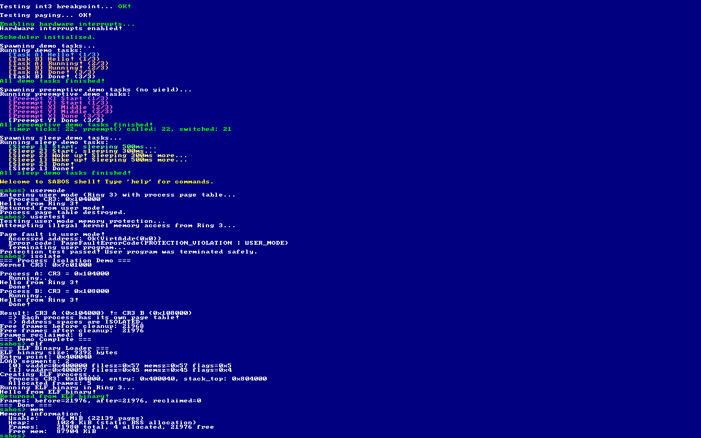

# 2026-02-03: Day 3 — ELF バイナリのロードと実行

Day 2 でユーザーモード (Ring 3) + プロセス分離まで実装した。でもユーザープログラムはカーネルバイナリに Rust 関数として埋め込まれていて、独立したバイナリではなかった。今日はいよいよ外部の ELF バイナリをカーネルにロードして Ring 3 で実行できるようにする。

## 今日のゴール

1. **ユーザープログラム crate の作成**: `x86_64-unknown-none` ターゲットで独立した ELF64 バイナリを生成
2. **ELF パーサー**: ELF64 ヘッダーとプログラムヘッダーをパースして LOAD セグメントを抽出
3. **ELF ローダー**: LOAD セグメントをプロセスのアドレス空間にマッピングしてデータをコピー
4. **シェルコマンド**: `elf` コマンドで ELF バイナリをロード・実行

## 設計判断

### ELF バイナリの配置方法

UEFI Boot Services を終了するとファイルシステムにアクセスできなくなるため、`include_bytes!` でカーネルバイナリにコンパイル時に埋め込む方式にした。将来的にファイルシステムを実装すればディスクから読み込む方式に切り替えられる。

### ターゲットの選択

ユーザープログラムは `x86_64-unknown-none` ターゲットでビルドする。これは OS を持たないベアメタル環境向けの ELF64 バイナリを出力する。カーネルの `x86_64-unknown-uefi` (PE 形式) とは別のフォーマットで、リンカスクリプトで `.text` セクションを `0x400000` (4MiB) に配置する。

### なぜ 0x400000 なのか

Linux の ELF ローダーがデフォルトで使うベースアドレスが `0x400000`。歴史的にこのアドレスが使われてきた理由は、低アドレス領域（0x0〜0x400000）をカーネルやヌルポインタガードに使えるように空けておくため。今回もこの慣習に従った。

### ABI の違い

重要な設計上のポイントとして、カーネル (`x86_64-unknown-uefi`) は **Microsoft x64 ABI** を使うのに対し、ユーザープログラム (`x86_64-unknown-none`) は **System V AMD64 ABI** を使う。システムコールのアセンブリでは System V 規約（rax=syscall番号, rdi=引数1, rsi=引数2）でレジスタをセットし、カーネル側のハンドラが Microsoft ABI の引数レジスタ（rcx, rdx, r8）に変換する。

## 実装ログ

### ユーザープログラム crate (`user/`)

`user/` ディレクトリに独立した Rust crate を作成した。`#![no_std]` + `#![no_main]` で OS なし環境向けのバイナリを生成する。

エントリポイント `_start` は `extern "C"` リンケージで、System V ABI に従う。`int 0x80` でシステムコールを呼び、SYS_WRITE (1) で "Hello from ELF binary!\n" を出力して SYS_EXIT (60) で終了する。

リンカスクリプト (`linker.ld`) で `.text` を `0x400000` に配置:

```ld
SECTIONS {
    . = 0x400000;
    .text : { *(.text .text.*) }
    .rodata : { *(.rodata .rodata.*) }
    .data : { *(.data .data.*) }
    .bss : { *(.bss .bss.*) }
}
```

`.cargo/config.toml` でデフォルトターゲットとリンカスクリプトを設定:

```toml
[build]
target = "x86_64-unknown-none"
[target.x86_64-unknown-none]
rustflags = ["-C", "link-arg=-Tlinker.ld", "-C", "relocation-model=static"]
```

ビルド結果を `objdump -d` で確認すると、`_start` が 0x400040 に配置されていて、`sys_write` と `sys_exit` のヘルパー関数がそれより前に配置されていた。

### ELF パーサー (`kernel/src/elf.rs`)

ELF64 のヘッダー構造体を `#[repr(C)]` で定義した。ELF フォーマットはバイナリ構造がシンプルで、ヘッダーの先頭 4 バイトが `\x7fELF` というマジックナンバーで始まる。

パーサーは最小限の検証だけ行う:
- マジックナンバー (`\x7fELF`)
- クラス (64-bit = ELFCLASS64)
- エンディアン (Little Endian)
- マシンタイプ (EM_X86_64 = 0x3E)

プログラムヘッダーから `PT_LOAD` (type=1) のセグメントを抽出して、仮想アドレス (vaddr)、ファイルサイズ (filesz)、メモリサイズ (memsz) を返す。BSS 領域は memsz > filesz の差分で表現される（ファイルにはデータがないがメモリ上はゼロ初期化する必要がある）。

### ELF ローダーとページマッピングの難関

ここが今日最もハマったところ。実装自体は一通り完成したのに、ELF バイナリを実行すると毎回ページフォルトが発生した。

#### 症状

`elf` コマンドを実行すると:

```
Running ELF binary in Ring 3...

Page fault in user mode!
  Accessed address: Ok(VirtAddr(0x1b))
  Error code: PageFaultErrorCode(PROTECTION_VIOLATION | CAUSED_BY_WRITE | USER_MODE)
```

アクセスアドレス 0x1b でページフォルト。0x1b は User Data セグメントセレクタの値で、明らかにおかしい。

#### デバッグ過程

まず `iretq` のスタックフレームが正しいか疑った。割り込みスタックフレームを出力したところ:

```
instruction_pointer: 0x400040   (正しい — _start のアドレス)
stack_pointer: 0x804000          (正しい — ユーザースタックトップ)
code_segment: Ring3, index 4     (正しい — User Code セレクタ)
stack_segment: Ring3, index 3    (正しい — User Data セレクタ)
```

`iretq` 自体は成功していた。RSP も 0x804000 で正しい。ではなぜ 0x1b へのアクセスが発生するのか。

次にプロセスのページテーブルを手動で辿って、0x400040 の物理アドレスを確認した:

```
page 0x400000 -> phys 0x400000
code at 0x400040: 00 00 00 00 00 00 00 00 00 00 00 00 ...
```

**コードが全部ゼロ！** 物理アドレス 0x400000 は UEFI のアイデンティティマッピングのアドレスそのものだった。ELF のコードが確保したフレーム (0x105000 等) にコピーされていたはずなのに、ページテーブルはカーネルの元のマッピング (phys=virt=0x400000) を指していた。

#### 根本原因: カーネルとのページテーブル共有

`map_user_pages_in_process()` が仮想アドレス 0x400000 の新しいフレームをマッピングしようとしたとき、L4 → L3 → L2 → L1 の中間テーブルはカーネルのアイデンティティマッピングから共有されたものだった。共有テーブルの L1 エントリを直接書き換えると、**カーネルのページテーブルも壊れてしまう**。しかも L1 エントリには既にカーネルのマッピング (phys=0x400000) があったので、「既にマッピング済み」と判定されて新しいフレームが設定されなかった。

#### 修正: 分岐コピーパターンの導入

Day 2 の `set_user_accessible_in_process()` で使った「分岐コピー」パターンを `map_user_pages_in_process()` にも導入した。カーネルと共有しているテーブルを検出して、新しいフレームにコピーしてからプロセス固有の変更を行う:

1. プロセスの L4[0] がカーネルの L3 を指している → L3 テーブルを新フレームにコピー
2. コピーした L3 の中で、L2 もカーネルと共有 → L2 テーブルもコピー
3. L2 の中の L1 もカーネルと共有 → L1 テーブルもコピー
4. コピーした L1 のエントリに新しいデータフレームを設定

これでカーネルのテーブルに影響を与えずに、プロセス固有のマッピングを作成できる。

#### もう一つのバグ: 同一ページに複数セグメント

ELF パーサーの出力を見ると:

```
[0] vaddr=0x400000 filesz=0x57 memsz=0x57
[1] vaddr=0x400057 filesz=0x45 memsz=0x45
```

2 つの LOAD セグメントが同じページ (0x400000-0x400FFF) に含まれている。`map_user_pages_in_process()` をセグメントごとに別々に呼ぶと、2回目の呼び出しで同じページに新しいフレームを割り当ててしまい、1回目にコピーしたデータが消える。

これを防ぐため、前回の呼び出しで確保済みのフレームリストを渡し、既にプロセス専用のフレームがマッピングされている場合は再利用するようにした。

#### jump_to_usermode の改善

もう一つの修正として、`jump_to_usermode` アセンブリ関数の 5 番目の引数 (`user_ss`) をスタック経由で渡す方式を廃止した。Microsoft x64 ABI では 5 番目以降の引数はスタックの `[rsp+40]` に置かれるが、コンパイラの最適化によってスタックレイアウトが変わると正しい値を読めない可能性がある。

代わりに、GDT の配置順序 (User Data → User Code) から `user_ss = user_cs - 8` が常に成り立つことを利用して、アセンブリ内で計算するようにした:

```asm
mov rax, rdx      ; rax = user_cs
sub rax, 8        ; rax = user_ss = user_cs - 8
push rax           ; SS
push r9            ; RSP
push r8            ; RFLAGS
push rdx           ; CS
push rcx           ; RIP
iretq
```

### ビルドシステム統合

Makefile に `build-user` ターゲットを追加し、`build` が `build-user` に依存するようにした。`make build` で user → kernel の順にビルドされ、`include_bytes!` が自動的に最新の ELF バイナリを埋め込む。

CI (`.github/workflows/build.yml`) にも `x86_64-unknown-none` ターゲットの追加と user crate のビルドステップを追加した。

## 最終結果

全コマンドが正常に動作:

```
sabos> usermode
Hello from Ring 3!

sabos> usertest
Page fault in user mode!
Protection test passed!

sabos> isolate
Process A: CR3 = 0x104000 ... Hello from Ring 3!
Process B: CR3 = 0x108000 ... Hello from Ring 3!
Frames reclaimed: 8

sabos> elf
Entry point: 0x400040
LOAD segments: 2
Hello from ELF binary!
Frames: before=21976, after=21976, reclaimed=0

sabos> mem
Frames: 21980 total, 4 allocated, 21976 free
```

`elf` コマンドの `reclaimed=0` は「ELF プロセスで確保したフレームが全て正しく解放されてプロセス作成前と同じ状態に戻った」ことを意味する（before == after なので差分がゼロ）。メモリリークなし。



## 学んだこと

- **ページテーブルの共有は危険**: プロセスのページテーブルがカーネルと中間テーブルを共有している場合、直接エントリを変更するとカーネルのマッピングが壊れる。変更が必要な場合は必ず分岐コピーしてからプロセス固有のテーブルを操作する
- **ELF のセグメントは同じページに重なることがある**: 小さなバイナリでは .text と .rodata が同一ページに収まる。ページ単位でフレームを管理する場合、セグメントをまたぐ重複に注意が必要
- **ABI の違いは常に意識する**: UEFI カーネル (Microsoft ABI) と ELF ユーザープログラム (System V ABI) では引数レジスタの規約が異なる。アセンブリでの引数渡しはスタック経由を避け、レジスタだけで完結させるのが安全

## 次にやりたいこと

- **ファイルシステム**: FAT32 を実装して、ディスクから ELF バイナリを読み込めるようにする
- **複数ユーザープロセスの同時実行**: タスクスケジューラとユーザーモードプロセスを統合する
- **仮想アドレス空間のレイアウト**: カーネル空間を上位アドレス、ユーザー空間を下位アドレスに配置する正式なレイアウトに移行する
- **mmap / brk**: ユーザープログラムが動的にメモリを確保できるシステムコールを追加する

---

# Day 4 — virtio-blk ドライバと FAT16 ファイルシステム

Day 3 まででカーネルに ELF バイナリを `include_bytes!` で埋め込んでロード・実行できるようになった。でもこれでは新しいプログラムを追加するたびにカーネルを再ビルドする必要がある。本物の OS ではディスクからプログラムを読み込むのが当然。今日は QEMU の virtio-blk デバイスを通じて FAT16 ディスクからファイルを読み出せるようにする。

## 今日のゴール

1. **PCI 列挙の仕上げ**: 既に書いた PCI バス列挙コードをコミットする
2. **virtio-blk ドライバ**: PCI で見つけた virtio-blk デバイスを初期化し、ブロック（セクタ）単位で読み取りできるようにする
3. **FAT16 ファイルシステム**: virtio-blk の上に FAT16 ドライバを実装し、ファイル一覧とファイル読み取りを可能にする
4. **ディスクから ELF 実行**: FAT16 上の ELF バイナリを読み込んでユーザーモードで実行する

## 実装計画

### Task 1: PCI 列挙のコミット

既にある未コミットのコードをコミットする。変更点:
- `kernel/src/pci.rs` (新規) — PCI Configuration Space アクセス、バス列挙、virtio-blk 探索
- `kernel/src/shell.rs` — `lspci` / `halt` コマンド追加
- `kernel/src/main.rs` — `mod pci;` 追加
- `Makefile` — `disk-img` ターゲット追加（FAT16 32MB + virtio-blk）
- `setup-ubuntu.sh` — `mtools` / `dosfstools` 追加

### Task 2: virtio-blk ドライバ

virtio は仮想化環境でホスト-ゲスト間の効率的な I/O を実現するための標準インターフェース。QEMU の `-drive if=virtio` で使われる。今回は virtio legacy (v0.9.5) インターフェースを実装する。

**変更ファイル:**
- `kernel/src/virtio_blk.rs` (新規) — virtio-blk ドライバ
  - BAR0 から I/O ポートベースアドレスを取得
  - デバイス初期化（ステータスネゴシエーション）
  - Virtqueue のセットアップ（Descriptor Table + Available Ring + Used Ring）
  - ブロック読み取り関数 `read_block(sector, buf)`
- `kernel/src/main.rs` — `mod virtio_blk;` 追加
- `kernel/src/shell.rs` — `blkread` テストコマンド追加

### Task 3: FAT16 ファイルシステム

FAT16 は DOS/Windows 時代から使われているシンプルなファイルシステム。構造が単純で実装しやすい。

**変更ファイル:**
- `kernel/src/fat16.rs` (新規) — FAT16 ドライバ
  - BPB (BIOS Parameter Block) のパース — セクタサイズ、クラスタサイズ、FAT の位置等
  - ルートディレクトリエントリの読み取り
  - FAT テーブルを辿ってクラスタチェーンを読むファイル読み取り
- `kernel/src/main.rs` — `mod fat16;` 追加
- `kernel/src/shell.rs` — `ls` コマンド（ファイル一覧）、`cat <file>` コマンド（ファイル内容表示）

### Task 4: ディスクから ELF 実行

**変更ファイル:**
- `kernel/src/shell.rs` — `run <file>` コマンド追加
  - FAT16 からファイルを読み込み
  - ELF パース → プロセス作成 → Ring 3 実行 → 破棄

## 実装ログ

### Task 1: PCI バス列挙 ✅

まずは virtio-blk デバイスを見つけるために PCI バスの列挙機能を実装した。

#### PCI とは

PCI (Peripheral Component Interconnect) は PC のデバイスを接続するバス規格。CPU から各デバイスの設定情報（ベンダー ID、デバイス ID、BAR 等）を読み書きできる。PCI Type 1 アクセス方式では、I/O ポート 0xCF8 (CONFIG_ADDRESS) にアドレスを書き込み、0xCFC (CONFIG_DATA) からデータを読み書きする。

CONFIG_ADDRESS のビット構造:
- bit 31: Enable bit (1 で有効)
- bit 23:16: バス番号 (0〜255)
- bit 15:11: デバイス番号 (0〜31)
- bit 10:8: ファンクション番号 (0〜7)
- bit 7:2: レジスタ番号 (4バイトアライン)

Configuration Space の主要レジスタ:
- 0x00: ベンダー ID (16bit) + デバイス ID (16bit)
- 0x08: クラスコード（デバイスの大分類）
- 0x10〜0x24: BAR0〜BAR5 (Base Address Register)

#### 実装した関数

- `pci_config_read32()` / `pci_config_read16()`: 設定情報の読み取り
- `read_bar()`: BAR の読み取り
- `enumerate_bus()`: バス 0 の全デバイス列挙
- `find_virtio_blk()`: virtio-blk デバイスの探索 (vendor=0x1AF4, device=0x1001)

マルチファンクションデバイスの判定も実装した。ヘッダータイプ (offset 0x0E) の bit 7 が 1 ならファンクション 1〜7 もスキャンする。

#### シェルコマンド

- `lspci`: PCI デバイス一覧を表示（BDF、ベンダー ID、デバイス ID、クラスコード）
- `halt`: CPU を停止 (`cli` + `hlt` ループで二度と復帰しない)

#### ビルドシステム更新

- Makefile に `disk-img` ターゲットを追加: 32MB FAT16 イメージを作成し、テストファイル (HELLO.TXT) とユーザープログラム (HELLO.ELF) を書き込む
- QEMU コマンドに `-drive if=virtio,format=raw,file=disk.img` を追加して virtio-blk デバイスとして接続
- setup-ubuntu.sh に `mtools` / `dosfstools` を追加（FAT16 イメージの作成に必要）

### Task 2: virtio-blk ドライバ ✅

virtio は仮想化環境でホストとゲスト間の効率的な I/O を実現するための標準インターフェース仕様。物理ハードウェアのエミュレーションよりオーバーヘッドが小さい。QEMU で `-drive if=virtio` を指定すると、ゲスト OS からは PCI バス上の virtio デバイス (vendor=0x1AF4) として見える。

今回実装したのは virtio legacy (v0.9.5) インターフェース。QEMU のデフォルトは legacy デバイス (device_id=0x1001) を使う。

#### PCI Transport と BAR0

virtio デバイスの設定レジスタは BAR0（Base Address Register 0）を通じてアクセスする。BAR0 が I/O ポート空間にマップされている場合（bit 0 = 1）、`in` / `out` 命令でレジスタを読み書きする。主要なレジスタ:

- Device Features (0x00): デバイスが対応する機能ビット
- Guest Features (0x04): ゲストが使いたい機能ビット
- Queue Address (0x08): Virtqueue の物理ページ番号
- Queue Size (0x0C): Virtqueue のエントリ数
- Queue Notify (0x10): デバイスへの通知
- Device Status (0x12): 初期化ステータス

初期化シーケンスは Reset → ACKNOWLEDGE → DRIVER → Feature negotiation → Virtqueue setup → DRIVER_OK。

#### Virtqueue (Split Virtqueue)

virtio の I/O は Virtqueue を通じて行われる。Virtqueue は 3 つのデータ構造で構成される:

1. **Descriptor Table**: I/O バッファの物理アドレス・長さ・フラグの配列。複数のディスクリプタを `next` フィールドでチェーンできる
2. **Available Ring**: ゲスト→デバイスへの「新しいリクエストがある」通知リング
3. **Used Ring**: デバイス→ゲストへの「リクエスト完了」通知リング

virtio-blk のブロック読み取りは 3 つのディスクリプタをチェーンする:
- [0] リクエストヘッダー (type=IN, sector=N)
- [1] データバッファ (512 バイト、デバイスが書き込む)
- [2] ステータスバイト (1 バイト、0=OK)

Available Ring にチェーンの先頭を書いて Queue Notify で通知し、Used Ring をポーリングして完了を待つ。

#### ハマったポイント: ページアライメント

最初の実装では Virtqueue のメモリを `Vec<u8>` で確保していたが、アドレスが `0x59f6e90` のようにページアラインされていなかった。legacy virtio の Queue Address レジスタは「物理アドレス ÷ 4096」を受け取るため、アラインされていないと下位ビットが切り捨てられて正しいアドレスにならない。

`alloc::alloc::alloc_zeroed` に `Layout::from_size_align(size, 4096)` を渡してページアラインのメモリを確保することで解決。修正後のアドレスは `0x59f6000` で、ページアラインが保証された。

#### テスト結果

```
Initializing virtio-blk... OK (65536 sectors, 32 MiB)
```

セクタ 0 の読み取りに成功し、FAT16 の BPB シグネチャ (0x55AA) を確認できた。

### Task 3: FAT16 ファイルシステム ✅

FAT (File Allocation Table) は DOS 時代から使われているシンプルなファイルシステム。FAT16 は最大 2GB のボリュームをサポートし、構造が単純で実装しやすい。

#### ディスクレイアウト

FAT16 のディスクは以下の領域に分かれる:

```
[ブートセクタ (BPB)]   ← セクタ 0
[予約セクタ...]         ← reserved_sectors 個分
[FAT #1]               ← num_fats × fat_size_16 セクタ
[FAT #2 (バックアップ)]
[ルートディレクトリ]    ← root_entry_count × 32 バイト
[データ領域]            ← クラスタ 2 から始まる
```

BPB (BIOS Parameter Block) はセクタ 0 の固定オフセットにあるパラメータ群で、セクタサイズ・クラスタサイズ・FAT の位置等を定義する。今回のディスクでは bytes_per_sector=512, sectors_per_cluster=4, reserved_sectors=4, num_fats=2, root_entry_count=512, fat_size_16=64 だった。

#### FAT テーブルとクラスタチェーン

FAT16 の各エントリは 16 ビット。ファイルのデータはクラスタ（連続するセクタのグループ）単位で管理される。ファイルが複数クラスタにまたがる場合、FAT テーブルがリンクリストのように次のクラスタ番号を示す。0xFFF8〜0xFFFF はチェーン終端を意味する。

#### ディレクトリエントリ

各エントリは 32 バイト固定長。ファイル名は 8.3 形式（名前 8 バイト + 拡張子 3 バイト、スペースでパディング）。先頭バイトが 0x00 ならディレクトリ終端、0xE5 なら削除済み。属性フラグで通常ファイル・ディレクトリ・ボリュームラベル・LFN（長いファイル名）を判別する。

#### テスト結果

```
sabos> ls
  HELLO.TXT           18
  HELLO.ELF         9392
  NVVARS           10391
  3 file(s)
sabos> cat HELLO.TXT
Hello from FAT16!
```

### Task 4: ディスクから ELF 実行 ✅

FAT16 の `read_file()` で読んだバイト列を既存の ELF パーサー (`elf.rs`) と ELF ローダー (`usermode.rs`) に渡すだけで動いた。Day 3 で `include_bytes!` 埋め込みデータに対して作ったコードが、ディスクから読んだデータに対してもそのまま使える。

```
sabos> run HELLO.ELF
Loading HELLO.ELF from disk...
  Loaded 9392 bytes
  Entry point: 0x400040
  LOAD segments: 2
Running in Ring 3...
Hello from ELF binary!
Program exited.
Frames: before=18896, after=18896, reclaimed=0
```

メモリリークなし (before == after)。プロセスが確保したページテーブルフレームと ELF データフレームが正しく解放されている。


### おまけ: sleep デモのハング修正

Day 2 で実装した sleep デモが動作しなくなっていた問題を修正した。原因は `yield_now()` で全タスクが Sleeping のとき、割り込みを有効→即無効のタイトループになり、タイマー割り込みが発火する隙がなかったこと。

修正: `yield_now()` で切り替え先がない場合、`enable_and_hlt()` で CPU を停止して次の割り込み（タイマー）を待つようにした。`enable_and_hlt()` はアトミックに sti + hlt を実行するため、割り込みの取りこぼしを防ぐ。

## 学んだこと

- **virtio の Virtqueue はページアラインが必須**: legacy virtio の Queue Address レジスタは物理ページ番号を受け取るため、4096 バイト境界に揃ったメモリが必要。ヒープアロケータのデフォルトアラインメント (8 バイト) では不十分
- **FAT16 はシンプルで実装しやすい**: BPB のパース、FAT チェーンの追跡、ディレクトリエントリの読み取りの 3 要素だけで基本的なファイル読み取りが実現できる
- **抽象化が効いている**: Day 3 で作った ELF パーサー/ローダーは `&[u8]` スライスを受け取る設計にしていたので、データの取得元が `include_bytes!` でもディスクでも変更なく使えた
- **enable_and_hlt() の重要性**: 割り込み有効化と hlt をアトミックに実行しないと、その隙間で割り込みを取りこぼす可能性がある。OS カーネルのスケジューラでは特に重要

### Task 5: FAT16 サブディレクトリ対応 ✅

ルートディレクトリのファイルしか読めないのは不便なので、サブディレクトリにもアクセスできるようにした。

#### FAT16 のサブディレクトリ構造

FAT16 のルートディレクトリは固定位置・固定サイズでデータ領域の直前に配置される（root_entry_count × 32 バイト）。一方、サブディレクトリはデータ領域にクラスタチェーンとして配置され、通常のファイルと同じようにクラスタを辿って読む。

サブディレクトリのディレクトリエントリには特殊なエントリが含まれる:
- `.` (カレントディレクトリ): 自分自身の先頭クラスタ
- `..` (親ディレクトリ): 親の先頭クラスタ（ルートの場合はクラスタ 0）

#### 実装した関数

- `list_subdir(first_cluster)`: サブディレクトリのエントリ一覧を取得。クラスタチェーンを辿る
- `parse_dir_entries()`: ディレクトリエントリのパース処理を共通化（ルートとサブディレクトリで共用）
- `list_dir(path)`: パスを解析してディレクトリ一覧を返す。"/" 区切りのパスを処理して階層を辿る
- `find_entry(path)`: パスを解析してファイル/ディレクトリのエントリを探す
- `read_file(path)`: パスを受け取るように変更（`find_entry()` を内部で使用）

#### シェルコマンドの更新

- `ls [path]`: 引数なしはルート、引数ありはそのパスのディレクトリを表示
  - サブディレクトリには `.` と `..` が含まれるが、見づらいので表示から除外
- `cat <path>`: `/SUBDIR/FILE.TXT` のようなパスでファイルを読める
- `run <path>`: `/SUBDIR/APP.ELF` のようなパスで ELF を実行できる

#### テスト結果

```
sabos> ls
Directory: /
  Name          Size     Attr
  ------------- -------- ----
  HELLO.TXT           18
  HELLO.ELF         9392
  NVVARS           10391
  SUBDIR               0 <DIR>
  4 file(s)
sabos> ls /SUBDIR
Directory: /SUBDIR
  Name          Size     Attr
  ------------- -------- ----
  TEST.TXT            26
  APP.ELF           9392
  2 file(s)
sabos> cat /SUBDIR/TEST.TXT
Hello from subdirectory!

sabos> run /SUBDIR/APP.ELF
Loading /SUBDIR/APP.ELF from disk...
FAT16: reading file 'APP.ELF', cluster=16, size=9392
  Loaded 9392 bytes
  Entry point: 0x400040
  LOAD segments: 2
Running in Ring 3...
Hello from ELF binary!
Program exited.
```

ネストしたサブディレクトリ（`/A/B/C/FILE.TXT`）も同じロジックで辿れる。

### Task 6: virtio-blk 書き込み対応 ✅

読み取り専用だった virtio-blk ドライバに書き込み機能を追加した。

#### virtio-blk の読み書きの違い

virtio-blk のリクエストは読み取り (IN) と書き込み (OUT) で構造がほぼ同じ。違いは:

1. **リクエストタイプ**: `VIRTIO_BLK_T_IN` (0) vs `VIRTIO_BLK_T_OUT` (1)
2. **データバッファのフラグ**: 読み取りは `VIRTQ_DESC_F_WRITE`（デバイスが書き込む）、書き込みはフラグなし（デバイスが読む）

`read_sector` のコードをほぼコピーして、この 2 点を変更するだけで `write_sector` が完成した。

#### テストコマンド

`blkwrite <sector>` コマンドを追加してテスト。セクタにテストパターンを書き込み、読み返して一致を確認する。

```
sabos> blkwrite 200
Sector 200 written successfully!
Verified: read-back matches written data.
```

### Task 7: FAT16 ファイル作成・削除 ✅

virtio-blk の書き込みを使って、FAT16 ファイルシステムにファイルを作成・削除する機能を実装した。

#### 実装した関数

- `write_sector()` - セクタ書き込み（内部ヘルパー）
- `write_fat_entry()` - FAT テーブルのエントリを更新（FAT #1 と #2 の両方）
- `find_free_cluster()` - FAT テーブルをスキャンして空きクラスタ (0x0000) を探す
- `allocate_clusters()` - 必要な数のクラスタを確保してチェーンを作成
- `free_cluster_chain()` - クラスタチェーンを解放
- `add_root_dir_entry()` - ルートディレクトリに新しいエントリを追加
- `create_file()` - ファイルを作成してデータを書き込む
- `delete_file()` - ファイルを削除（ディレクトリエントリを 0xE5 でマーク、クラスタ解放）

#### FAT16 ファイル作成の手順

1. 同名ファイルが存在しないか確認
2. 必要なクラスタ数を計算（ファイルサイズ ÷ クラスタサイズ）
3. 空きクラスタを確保してチェーンを作成
4. データをクラスタに書き込む
5. ルートディレクトリにエントリを追加（8.3 形式のファイル名）

#### シェルコマンド

- `write <name> <text>` - ファイル作成（例: `write TEST.TXT Hello`）
- `rm <name>` - ファイル削除

#### テスト結果

```
sabos> write A.TXT Hi
FAT16: creating file 'A.TXT', size=3, clusters=1
FAT16: file created successfully, first_cluster=21
File 'A.TXT' created (3 bytes)

sabos> ls
  A.TXT                3
  5 file(s)

sabos> cat A.TXT
Hi

sabos> rm A.TXT
FAT16: file 'A.TXT' deleted
File 'A.TXT' deleted
```

ファイルの作成・読み取り・削除が一通り動作している。

## 学んだこと

- **virtio の Virtqueue はページアラインが必須**: legacy virtio の Queue Address レジスタは物理ページ番号を受け取るため、4096 バイト境界に揃ったメモリが必要。ヒープアロケータのデフォルトアラインメント (8 バイト) では不十分
- **FAT16 はシンプルで実装しやすい**: BPB のパース、FAT チェーンの追跡、ディレクトリエントリの読み取りの 3 要素だけで基本的なファイル読み取りが実現できる
- **FAT16 のルートディレクトリとサブディレクトリの違い**: ルートは固定位置・固定サイズ、サブディレクトリはクラスタチェーン。この違いを意識して共通処理を抽出すると実装がきれいになる
- **抽象化が効いている**: Day 3 で作った ELF パーサー/ローダーは `&[u8]` スライスを受け取る設計にしていたので、データの取得元が `include_bytes!` でもディスクでも変更なく使えた
- **enable_and_hlt() の重要性**: 割り込み有効化と hlt をアトミックに実行しないと、その隙間で割り込みを取りこぼす可能性がある。OS カーネルのスケジューラでは特に重要
- **FAT16 書き込みは読み取りの延長**: FAT テーブルの更新、空きクラスタの探索、ディレクトリエントリの追加という基本操作の組み合わせでファイル作成が実現できる
- **virtio-blk の読み書きはほぼ同じ**: リクエストタイプとバッファフラグの違いだけで、コードの大部分を共有できる

### Task 8: virtio-net ドライバとネットワークスタック ✅

ネットワーク通信の基盤を実装した。virtio-blk と同じ virtio フレームワークを使うので、経験を活かせた。

#### virtio-net ドライバ

virtio-blk との主な違い:
- 2 つの Virtqueue: receiveq (queue 0) と transmitq (queue 1)
- パケットの前に virtio-net ヘッダー (10 バイト) が付く
- MAC アドレスを device config から読み取る

初期化シーケンスは virtio-blk とほぼ同じで、2 つの Virtqueue をセットアップする点だけ異なる。受信バッファは 16 個（各 2048 バイト）を事前に確保して receiveq に登録しておく。

```
virtio-net found at PCI 00:02.0
virtio-net I/O base: 0x60e0
virtio-net MAC: 52:54:00:12:34:56
virtio-net status after init: 0x7
OK (MAC 52:54:00:12:34:56)
```

#### ネットワークプロトコルスタック

最小限のプロトコルスタックを実装:

1. **Ethernet**: 14 バイトのヘッダー（宛先 MAC + 送信元 MAC + EtherType）をパース
2. **ARP**: IP アドレスから MAC アドレスを解決。ARP Request を受信したら Reply を返す
3. **IPv4**: ヘッダー（20 バイト）をパースして、宛先 IP が自分宛かチェック
4. **ICMP**: Echo Request (ping) を受信したら Echo Reply を返す

チェックサム計算は RFC 1071 に従って 16 ビット 1 の補数の和の 1 の補数を計算。IP ヘッダーと ICMP パケットの両方でチェックサムを設定する必要がある。

#### QEMU のネットワーク設定

QEMU の user mode networking (SLIRP) を使用:
- ゲストの IP: 10.0.2.15
- ゲートウェイ: 10.0.2.2
- DNS: 10.0.2.3

ホストからゲストへの直接 ping は SLIRP の制限でできないが、ゲスト内で ARP/ICMP の処理が動作していることはシリアルログで確認できる。

#### シェルコマンド

- `ip` - IP 設定を表示（IP アドレス、ゲートウェイ、MAC アドレス）
- `netpoll [秒数]` - 指定秒数（デフォルト 10 秒）ネットワークをポーリング

```
sabos> ip
IP Configuration:
  IP Address: 10.0.2.15
  Gateway:    10.0.2.2
  MAC:        52:54:00:12:34:56
```

## 学んだこと

- **virtio の Virtqueue はページアラインが必須**: legacy virtio の Queue Address レジスタは物理ページ番号を受け取るため、4096 バイト境界に揃ったメモリが必要。ヒープアロケータのデフォルトアラインメント (8 バイト) では不十分
- **FAT16 はシンプルで実装しやすい**: BPB のパース、FAT チェーンの追跡、ディレクトリエントリの読み取りの 3 要素だけで基本的なファイル読み取りが実現できる
- **FAT16 のルートディレクトリとサブディレクトリの違い**: ルートは固定位置・固定サイズ、サブディレクトリはクラスタチェーン。この違いを意識して共通処理を抽出すると実装がきれいになる
- **抽象化が効いている**: Day 3 で作った ELF パーサー/ローダーは `&[u8]` スライスを受け取る設計にしていたので、データの取得元が `include_bytes!` でもディスクでも変更なく使えた
- **enable_and_hlt() の重要性**: 割り込み有効化と hlt をアトミックに実行しないと、その隙間で割り込みを取りこぼす可能性がある。OS カーネルのスケジューラでは特に重要
- **FAT16 書き込みは読み取りの延長**: FAT テーブルの更新、空きクラスタの探索、ディレクトリエントリの追加という基本操作の組み合わせでファイル作成が実現できる
- **virtio-blk の読み書きはほぼ同じ**: リクエストタイプとバッファフラグの違いだけで、コードの大部分を共有できる
- **virtio-net は virtio-blk の応用**: 同じ virtio フレームワークを使うので、virtio-blk の実装経験があれば比較的スムーズに実装できる。違いは Virtqueue が 2 つある点と、パケットの前にヘッダーが付く点
- **ネットワークプロトコルは階層構造**: Ethernet → ARP/IP → ICMP と階層を意識すると実装が整理される

### Task 9: マルチプロセス対応 ✅

TCP サーバーを実装するためにはマルチプロセス（複数のユーザープロセスを同時に実行する能力）が必要。Day 2 で実装したカーネルタスク用のスケジューラを拡張して、ユーザープロセスもタスクとして管理できるようにした。

#### 設計

**課題:**
- 既存の `scheduler.rs` はカーネルタスク（`fn()` を実行する軽量スレッド）を管理
- 既存の `usermode.rs` はブロッキング実行（SYS_EXIT まで戻らない）

**解決策:**
ユーザープロセスをカーネルタスクとしてスケジューラに登録し、コンテキストスイッチ時に CR3（ページテーブル）も一緒に切り替える。

#### 実装した変更

**1. Task 構造体の拡張 (scheduler.rs)**
```rust
pub struct Task {
    // 既存フィールド
    pub id: u64,
    pub name: String,  // &'static str から String に変更（動的な名前対応）
    pub state: TaskState,
    pub context: Context,
    _stack: Option<Box<[u8]>>,
    // 新規追加
    pub cr3: Option<PhysFrame<Size4KiB>>,  // ユーザープロセスのページテーブル
    pub user_process_info: Option<UserProcessInfo>,
    pub is_user: bool,
}
```

**2. コンテキストスイッチで CR3 も切り替え**
```asm
context_switch:
    ; 既存のレジスタ保存処理
    push rbp
    ...
    mov [rcx], rsp    ; 現在の rsp を保存
    mov rsp, rdx      ; 新しい rsp に切り替え
    mov cr3, r8       ; CR3 を切り替え（新規追加！）
    ; 既存のレジスタ復元処理
    pop r15
    ...
    ret
```

**3. spawn_user() 関数**
```rust
pub fn spawn_user(name: &str, elf_data: &[u8]) -> Result<u64, &'static str> {
    // 1. ELF からユーザープロセスを作成
    // 2. カーネルタスクとしてスケジューラに登録
    // 3. user_task_trampoline をエントリに設定
}
```

**4. user_task_trampoline (アセンブリ)**
新規タスクが初めてスケジュールされたとき:
1. 割り込みを有効化（sti）
2. タスク ID からユーザープロセス情報を取得
3. TSS rsp0 を設定
4. iretq で Ring 3 に遷移

**5. シェルコマンド**
- `spawn <file>` - ELF をバックグラウンドで実行
- `ps` - TYPE 列で kernel/user を表示

#### 動作確認

```
sabos> spawn HELLO.ELF
Loading HELLO.ELF from disk...
  Loaded 9392 bytes
[scheduler] spawned user task 7 'HELLO.ELF' (entry: 0x400040)
Process 'HELLO.ELF' spawned as task 7 (background)
Use 'ps' to see running tasks.
sabos> Hello from ELF binary!  ← バックグラウンドで出力
ps
  ID  STATE       TYPE    NAME
  --  ----------  ------  ----------
   0  Running     kernel  kernel
   1  Finished    kernel  demo_a
   ...
   7  Finished    user    HELLO.ELF  ← ユーザープロセス！
  Total: 8 tasks (1 active)
```

`spawn` コマンドで起動したプロセスはバックグラウンドで実行され、シェルは即座にプロンプトを返す。プロセスの出力（"Hello from ELF binary!"）はプロンプトの後に表示される。これは正常な動作で、プロセスがスケジューラによって実行されていることを示している。

#### コンテキストスイッチの流れ

1. シェル（task 0）が `spawn` でユーザープロセス（task 7）を登録
2. 次の `yield_now()` または `preempt()` で task 7 にスイッチ
3. `context_switch` で RSP と CR3 を同時に切り替え
4. `user_task_trampoline` → `user_task_entry_wrapper` → `iretq` で Ring 3 に遷移
5. ユーザーコードが実行される
6. タイマー割り込みで `preempt()` → シェル（task 0）に戻る
7. シェルは次のコマンドを受け付けられる
8. `SYS_EXIT` → `exit_usermode()` → `user_task_exit_handler` → タスク Finished

## 学んだこと

- **virtio の Virtqueue はページアラインが必須**: legacy virtio の Queue Address レジスタは物理ページ番号を受け取るため、4096 バイト境界に揃ったメモリが必要。ヒープアロケータのデフォルトアラインメント (8 バイト) では不十分
- **FAT16 はシンプルで実装しやすい**: BPB のパース、FAT チェーンの追跡、ディレクトリエントリの読み取りの 3 要素だけで基本的なファイル読み取りが実現できる
- **FAT16 のルートディレクトリとサブディレクトリの違い**: ルートは固定位置・固定サイズ、サブディレクトリはクラスタチェーン。この違いを意識して共通処理を抽出すると実装がきれいになる
- **抽象化が効いている**: Day 3 で作った ELF パーサー/ローダーは `&[u8]` スライスを受け取る設計にしていたので、データの取得元が `include_bytes!` でもディスクでも変更なく使えた
- **enable_and_hlt() の重要性**: 割り込み有効化と hlt をアトミックに実行しないと、その隙間で割り込みを取りこぼす可能性がある。OS カーネルのスケジューラでは特に重要
- **FAT16 書き込みは読み取りの延長**: FAT テーブルの更新、空きクラスタの探索、ディレクトリエントリの追加という基本操作の組み合わせでファイル作成が実現できる
- **virtio-blk の読み書きはほぼ同じ**: リクエストタイプとバッファフラグの違いだけで、コードの大部分を共有できる
- **virtio-net は virtio-blk の応用**: 同じ virtio フレームワークを使うので、virtio-blk の実装経験があれば比較的スムーズに実装できる。違いは Virtqueue が 2 つある点と、パケットの前にヘッダーが付く点
- **ネットワークプロトコルは階層構造**: Ethernet → ARP/IP → ICMP と階層を意識すると実装が整理される
- **コンテキストスイッチと CR3 の同時切り替え**: ユーザープロセスはそれぞれ独自のページテーブルを持つため、タスクを切り替えるときに CR3 も一緒に切り替える必要がある。アセンブリで rsp と cr3 を連続して切り替えることで、アドレス空間の遷移がアトミックに行われる

### Task 10: UDP/DNS クライアント ✅

TCP クライアントを実装する前に、より単純な UDP プロトコルで DNS クライアントを実装した。DNS は UDP ポート 53 を使うため、UDP プロトコルと DNS プロトコルの両方を実装する必要がある。

#### UDP プロトコル

UDP (User Datagram Protocol) は IP の上に乗る軽量なトランスポートプロトコル。TCP と違ってコネクションレスで、信頼性保証（再送・順序保証）がない代わりにシンプル。DNS のような単発のリクエスト/レスポンスに適している。

UDP ヘッダーは 8 バイト:
- src_port (2 bytes): 送信元ポート
- dst_port (2 bytes): 宛先ポート
- length (2 bytes): UDP ヘッダー + ペイロードの長さ
- checksum (2 bytes): チェックサム（IPv4 では省略可能で 0 にできる）

```rust
#[repr(C, packed)]
pub struct UdpHeader {
    pub src_port: [u8; 2],
    pub dst_port: [u8; 2],
    pub length: [u8; 2],
    pub checksum: [u8; 2],
}
```

`send_udp_packet()` 関数で UDP パケットを送信:
1. Ethernet ヘッダー（14 バイト）+ virtio-net ヘッダー（10 バイト）
2. IP ヘッダー（20 バイト、protocol = 17 = UDP）
3. UDP ヘッダー（8 バイト）
4. ペイロード

#### DNS プロトコル

DNS (Domain Name System) はドメイン名から IP アドレスを解決するプロトコル。クエリとレスポンスの両方が同じフォーマットを使う。

DNS ヘッダーは 12 バイト:
- id (2 bytes): トランザクション ID（リクエストとレスポンスを紐付ける）
- flags (2 bytes): QR（0=クエリ/1=レスポンス）、OPCODE、AA、TC、RD、RA、RCODE
- qdcount (2 bytes): 質問セクションのエントリ数
- ancount (2 bytes): 回答セクションのエントリ数
- nscount (2 bytes): 権威セクションのエントリ数
- arcount (2 bytes): 追加セクションのエントリ数

ドメイン名はラベル形式でエンコード:
- 各ラベルの前に長さバイト
- 例: "google.com" → `\x06google\x03com\x00`
- 最後は 0x00 で終端

クエリセクション:
- QNAME: ドメイン名（ラベル形式）
- QTYPE: レコードタイプ（A=1 は IPv4 アドレス）
- QCLASS: クラス（IN=1 はインターネット）

レスポンスの回答セクション:
- NAME: ドメイン名（圧縮ポインタ 0xC00C でヘッダー直後を指すことが多い）
- TYPE: レコードタイプ
- CLASS: クラス
- TTL: Time To Live（4 バイト）
- RDLENGTH: RDATA の長さ
- RDATA: A レコードの場合は 4 バイトの IP アドレス

```rust
pub fn dns_lookup(domain: &str) -> Result<[u8; 4], &'static str> {
    // 1. DNS クエリパケットを構築
    let query = build_dns_query(domain);
    // 2. UDP で DNS サーバー (10.0.2.3:53) に送信
    send_udp_packet(DNS_SERVER_IP, 53, 12345, &query);
    // 3. レスポンスを待つ（最大 3 秒、ポーリング）
    // 4. A レコードの IP アドレスをパースして返す
}
```

#### QEMU SLIRP のネットワーク

QEMU の user mode networking (SLIRP) では:
- ゲスト IP: 10.0.2.15
- DNS サーバー: 10.0.2.3（SLIRP がホストの DNS に転送）

ゲストから 10.0.2.3 に DNS クエリを送ると、SLIRP がホスト OS の DNS 解決を使って応答を返す。

#### 動作確認

```
sabos> dns google.com
Resolving 'google.com'...
dns: sending query for 'google.com'
net: ARP Request for 10.0.2.15 from 10.0.2.2
net: sent ARP Reply
net: UDP packet from port 53 to port 12345, len=44
dns: response with 1 questions, 1 answers
dns: resolved to 142.250.199.142
google.com -> 142.250.199.142
```

1. DNS クエリを送信すると、まず SLIRP から ARP Request が来る
2. カーネルが ARP Reply を返す
3. その後 DNS レスポンス（UDP ポート 53 → 12345）が届く
4. A レコードをパースして IP アドレスを表示

DNS クエリ→レスポンスの往復が正常に動作している。これで TCP クライアントの実装前提条件が整った。

### Task 11: 自動テストフレームワーク ✅

開発サイクルを高速化するため、自動テストの仕組みを導入した。

#### selftest コマンド

シェルに `selftest` コマンドを追加。各サブシステムを自動テストして結果を表示する:

```
sabos> selftest
=== SELFTEST START ===
[PASS] memory_allocator
[PASS] paging
[PASS] scheduler
[PASS] virtio_blk
[PASS] fat16
[PASS] network_dns
=== SELFTEST END: 6/6 PASSED ===
```

テスト内容:
- **memory_allocator**: Box と Vec のアロケーション/解放
- **paging**: アドレス変換（アイデンティティマッピングの確認）
- **scheduler**: タスク spawn と完了待ち
- **virtio_blk**: セクタ 0 読み取りと FAT16 シグネチャ確認
- **fat16**: HELLO.TXT の読み取りと内容確認
- **network_dns**: example.com の DNS lookup

出力形式は CI でパースしやすいように、最後の行で `PASSED` または `FAILED` を明示する。

#### テストランナースクリプト

`scripts/run-selftest.sh` を作成:
1. QEMU をバックグラウンドで起動
2. シェルプロンプトを待つ
3. telnet monitor 経由で `selftest` コマンドを送信
4. 結果を待ってパース
5. PASS/FAIL に応じて終了コードを返す

```bash
make test  # ← これだけでテスト実行
```

#### GitHub Actions 統合

`.github/workflows/build.yml` を拡張して test ジョブを追加:
- build ジョブ成功後に test ジョブを実行
- Ubuntu で QEMU + OVMF + mtools をインストール
- `make test` で selftest を実行
- テスト失敗時は CI も失敗

これで push/PR のたびに自動でテストが走る。リグレッションを早期に検出できる。

## 学んだこと

- **virtio の Virtqueue はページアラインが必須**: legacy virtio の Queue Address レジスタは物理ページ番号を受け取るため、4096 バイト境界に揃ったメモリが必要。ヒープアロケータのデフォルトアラインメント (8 バイト) では不十分
- **FAT16 はシンプルで実装しやすい**: BPB のパース、FAT チェーンの追跡、ディレクトリエントリの読み取りの 3 要素だけで基本的なファイル読み取りが実現できる
- **FAT16 のルートディレクトリとサブディレクトリの違い**: ルートは固定位置・固定サイズ、サブディレクトリはクラスタチェーン。この違いを意識して共通処理を抽出すると実装がきれいになる
- **抽象化が効いている**: Day 3 で作った ELF パーサー/ローダーは `&[u8]` スライスを受け取る設計にしていたので、データの取得元が `include_bytes!` でもディスクでも変更なく使えた
- **enable_and_hlt() の重要性**: 割り込み有効化と hlt をアトミックに実行しないと、その隙間で割り込みを取りこぼす可能性がある。OS カーネルのスケジューラでは特に重要
- **FAT16 書き込みは読み取りの延長**: FAT テーブルの更新、空きクラスタの探索、ディレクトリエントリの追加という基本操作の組み合わせでファイル作成が実現できる
- **virtio-blk の読み書きはほぼ同じ**: リクエストタイプとバッファフラグの違いだけで、コードの大部分を共有できる
- **virtio-net は virtio-blk の応用**: 同じ virtio フレームワークを使うので、virtio-blk の実装経験があれば比較的スムーズに実装できる。違いは Virtqueue が 2 つある点と、パケットの前にヘッダーが付く点
- **ネットワークプロトコルは階層構造**: Ethernet → ARP/IP → ICMP と階層を意識すると実装が整理される
- **コンテキストスイッチと CR3 の同時切り替え**: ユーザープロセスはそれぞれ独自のページテーブルを持つため、タスクを切り替えるときに CR3 も一緒に切り替える必要がある。アセンブリで rsp と cr3 を連続して切り替えることで、アドレス空間の遷移がアトミックに行われる
- **UDP は TCP より単純**: コネクション管理がないのでステートレスに実装できる。DNS のような単発のリクエスト/レスポンスには最適
- **DNS のラベル形式**: ドメイン名をドット区切りではなく「長さ+文字列」の連続で表現する。パースもシリアライズも単純なループで実装できる
- **自動テストは早めに導入すべき**: 手動テストは面倒で漏れやすい。selftest コマンド + CI の組み合わせで、変更のたびに自動検証される安心感がある
- **QEMU の telnet monitor は便利**: sendkey コマンドでキーボード入力をシミュレートできるので、対話的なテストも自動化できる

## 次にやりたいこと

- **TCP クライアント**: DNS で名前解決ができるようになったので、TCP コネクションを張って HTTP リクエストを送る
- **ping テストの完全な動作確認**: TAP ネットワークを使ってホストから実際に ping を通す
- **仮想アドレス空間のレイアウト**: カーネル空間を上位アドレス、ユーザー空間を下位アドレスに配置する
- **mmap / brk**: ユーザープログラムが動的にメモリを確保できるシステムコールを追加する
